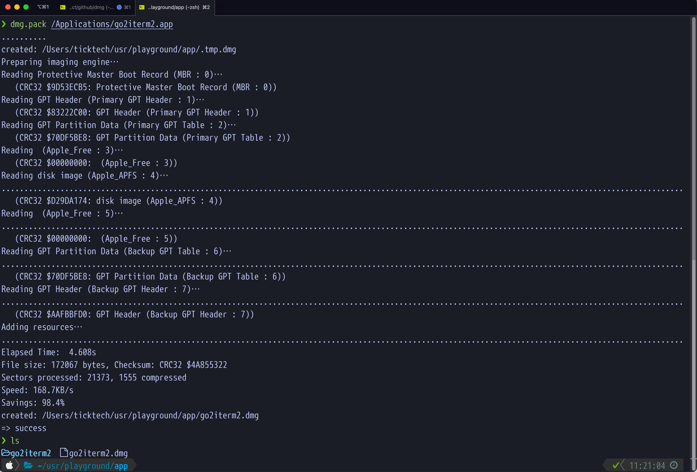

# dmg
script for packaging a xxx.app to a dmg image on macOS

# install

Source the script in your bashrc or zshrc

```bash
# ~/.bashrc for bash
cp dmg.sh ~/.dmg.sh
source ~/.dmg.sh
```

# Usage

```bash
# create an myapp.dmg with myapp.app
# It is a combination of dmg.init and dmg.create
dmg.pack myapp.app

## init myapp folder with a symbol link of /Applications
dmg.init myapp

## create a dmg with a given folder
dmg.create myapp

```

# screenshots


